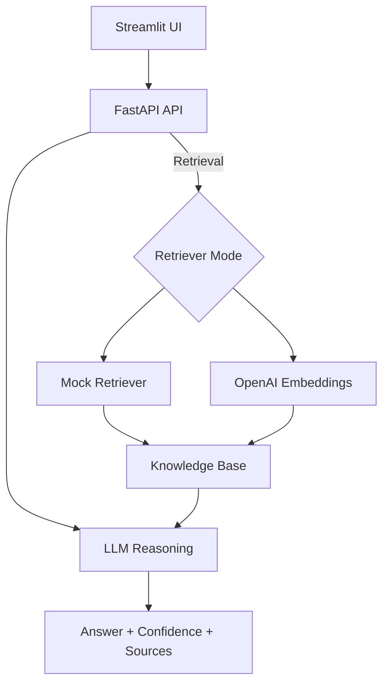
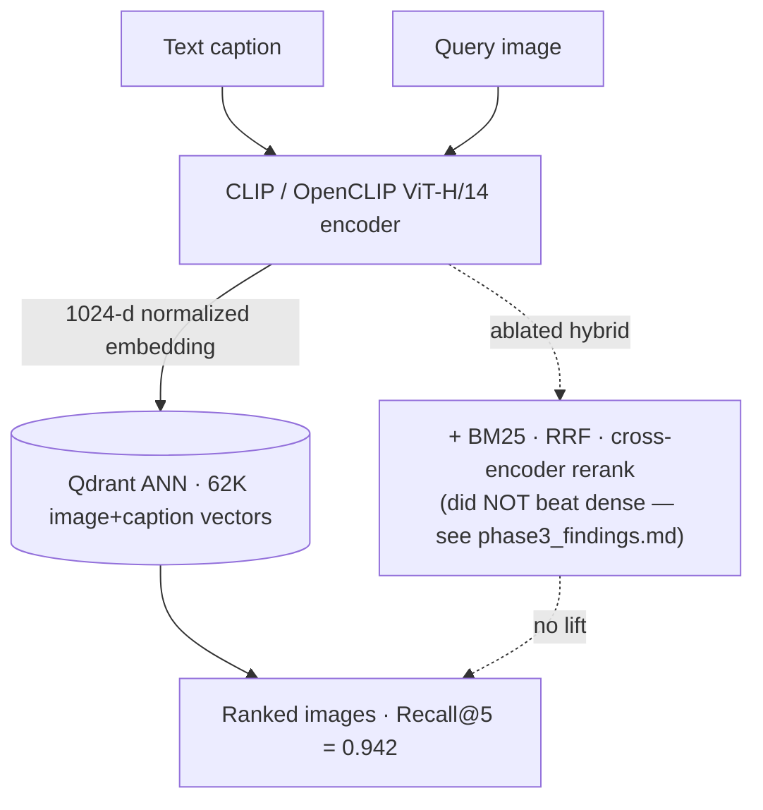

# 💬 Personal RAG Q&A System

> **Intelligent Q&A system for personal websites powered by RAG technology with advanced anti-hallucination strategies**

[](https://www.python.org/downloads/)
[](https://fastapi.tiangolo.com/)
[](https://streamlit.io/)
[](https://opensource.org/licenses/MIT)

## 🔗 Quick Links

- **🌐 Live Demo**: **[dzpersonal-rag-demo.streamlit.app](https://dzpersonal-rag-demo.streamlit.app/)** (public, no login required)
- **Local Frontend**: `http://localhost:8501` (after running `streamlit run frontend/personal_app.py`)
- **API Docs (FastAPI)**: `http://localhost:8000/docs`
- **Quickstart**: [Getting Started](#-quick-start)
- **Architecture & Metrics**: [Architecture](#-architecture) · [Metrics & Evaluation](docs/metrics.md)
- **Technical Guide**: [Project Startup, Architecture, CI/CD, and Interview Notes](docs/TECHNICAL_GUIDE.md)
- **Portfolio Positioning**: [Project Positioning & Job-Search Roadmap](docs/PROJECT_POSITIONING.md)
- **Contributing**: [CONTRIBUTING.md](CONTRIBUTING.md)
- **Data Quality & Monitoring**: [Observability Notes](docs/observability.md)

## 🎯 Overview

This project demonstrates a **production-ready RAG (Retrieval-Augmented Generation) system** specifically designed for personal website Q&A functionality. Visitors can ask questions about you in natural language, and the system provides accurate, context-aware answers based on your personal knowledge base.

### Two distinct layers (kept separate on purpose)

- **Layer A — Personal Q&A assistant**: a text RAG that answers questions about the owner from a
  personal knowledge base, with anti-hallucination strategies, confidence scoring, and source tracing.
  *Quality here is about answer faithfulness — not a retrieval percentage.*
- **Layer B — Multimodal retrieval engine**: caption→image and image→image search over Flickr30k
  using CLIP / OpenCLIP + Qdrant, **benchmarked at 94.2% Recall@5** (OpenCLIP ViT-H/14, standard
  5,000-caption protocol). **This 94.2% is Layer B's retrieval metric — it is _not_ the personal-Q&A
  "accuracy".**

The two layers share infrastructure (FastAPI, typed schemas, tests, CI) but are **evaluated
separately**. The benchmark numbers below describe Layer B.

### Key Highlights

- ✅ **Anti-Hallucination Strategies**: Multiple mechanisms ensure AI doesn't fabricate information
- ✅ **Production-Ready**: Structured logging, metrics, monitoring, and feedback collection
- ✅ **Dual Mode**: Mock mode (no API costs) and OpenAI mode (high-quality embeddings)
- ✅ **Modern UI**: Conversation-style interface with real-time feedback
- ✅ **Comprehensive Testing**: Unit tests, integration tests, and CI/CD pipeline

## 📊 Evidence & Benchmarks (real, reproducible numbers)

Beyond the Q&A app, this repo includes an **eval-first** engagement that backs the headline
claims with measured numbers on a public benchmark (Flickr30k caption→image retrieval).
Everything below is reproduced in-harness; artifacts live under `eval/results/`.

**Retrieval quality** — standard 5,000-caption protocol, 1K-image gallery, with 95% CIs:

| Dense backbone | Recall@5 | Recall@10 | MRR@10 | nDCG@10 |
|---|---|---|---|---|
| CLIP ViT-B/32 (baseline) | 0.844 ±0.010 | 0.902 | 0.699 | 0.748 |
| **OpenCLIP ViT-H/14 (shipped)** | **0.942 ±0.006** | 0.967 | 0.847 | 0.877 |

- The **0.94 Recall@5** is reached via a stronger dense backbone — **not** BM25-RRF or a text
  cross-encoder reranker, which an honest ablation showed plateau at ~0.84 (a structural ceiling;
  see `eval/results/phase3_findings.md`). Corroborated by LAION's published ViT-H/14 number (94.0).
- Index: **62,028 CLIP vectors** (31,014 images + 31,014 captions) in **Qdrant**; vector-DB rankings
  proven identical to a numpy baseline (1000/1000, `faithfulness.json`).

**Load test** — Locust, mock mode (serving + retrieval layer), single `uvicorn` worker:

| Concurrency | Throughput | p50 | p95 | p99 | Failures |
|---|---|---|---|---|---|
| 100 users | 325 req/s | 2 ms | 5 ms | 19 ms | **0%** |
| 500 users | 1,151 req/s | 110 ms | 180 ms | **210 ms** | **0%** |

Zero failures at 500 concurrent users with sub-second p99. Full report: `tests/load/results/load_report.md`.

**Kubernetes autoscaling (observed, local kind cluster)** — deployed to a local kind cluster and
drove the Locust load through a NodePort; the HPA scaled on CPU:

| Phase | CPU util / target | Ready pods |
|---|---|---|
| baseline | 3% / 50% | **2** |
| under 500-user load | peaked **300%** / 50% | **6** (scaled 2→6 in ~40s) |
| load removed | → 3% / 50% | **6 → 3 → 2** (back to floor, ~115s) |

Real run (`make k8s-demo`), 79,228 requests / 0 failures while scaled out. It's a **local kind
demo, not a cloud/production deployment**, and the HPA is tuned for a short observable run — full
detail + caveats in `k8s/results/autoscaling_report.md`.

**Multimodal search endpoints** (served from the OpenCLIP gallery, gated/lazy):
`POST /search/text` (caption→image) and `POST /search/image` (reverse image search). Qualitative
examples: `eval/results/phase2_qualitative.md`.

## 🏗️ Architecture

```
┌─────────────────┐
│  Streamlit UI   │  (Modern Conversation Interface)
└────────┬────────┘
         │
         ▼
┌─────────────────┐
│   FastAPI API   │  (REST Endpoints + Metrics)
└────────┬────────┘
         │
    ┌────┴────┐
    ▼         ▼
┌────────┐ ┌──────────┐
│ Mock   │ │  OpenAI  │  (Embedding Models)
│ Retriever│ │ Embeddings│
└───┬────┘ └────┬─────┘
    │           │
    └─────┬─────┘
          ▼
    ┌──────────┐
    │ Knowledge│  (Personal Data)
    │   Base   │
    └─────┬────┘
          │
          ▼
    ┌──────────┐
    │   LLM    │  (GPT-3.5/4)
    │ Reasoning│  (Low Temp + Strict Prompts)
    └──────────┘
          │
          ▼
    ┌──────────┐
    │ Response │  (With Confidence + Sources)
    └──────────┘
```

### Layer A — Personal Q&A flow (Mermaid)



### Layer B — Multimodal retrieval engine (Mermaid)

The shipped retrieval path is **dense only** (CLIP/OpenCLIP → Qdrant). BM25 + RRF + a
cross-encoder reranker were evaluated and **did not beat dense** (~0.84 ceiling) — the
0.942 lift comes from the **ViT-H/14 backbone**, not fusion/reranking.



Served via `POST /search/text` (caption→image) and `POST /search/image` (reverse image).

## 🛡️ Anti-Hallucination Strategies

This system implements **4 key strategies** to prevent AI fabrication:

### 1. **Low Temperature Generation** (0.3)
- Reduces randomness in LLM responses
- Increases determinism and factual accuracy
- Configurable via environment variables

### 2. **Strict Prompt Engineering**
- Explicit system prompts: "Only use provided context"
- Clear instructions to state when information is unavailable
- No speculation or fabrication allowed

### 3. **Confidence Assessment**
- Three-level confidence scoring (High/Medium/Low)
- Based on retrieval similarity scores
- Visual indicators in UI

### 4. **Source Tracing & Verification**
- Every answer includes source documents
- Relevance scores for each source
- Optional second-pass verification mode

## ✨ Features

### Core Capabilities
- 🔤 **Semantic Search** - Natural language queries with OpenAI embeddings
- 🤖 **RAG-Powered Q&A** - Contextual answers with LLM integration
- 💬 **Conversation Mode** - Multi-turn dialogue with context retention
- 📊 **Real-time Metrics** - Monitor system performance and latency
- 💭 **User Feedback** - Collect ratings to improve quality

### Technical Features
- **Dual Retrieval Modes**: Mock (keyword-based, no API) or OpenAI (semantic embeddings)
- **Structured Logging**: JSON-formatted logs for production monitoring
- **Metrics Endpoint**: Prometheus-compatible metrics for observability
- **Feedback Collection**: Store user feedback for continuous improvement
- **Category Weighting**: Boost important document categories (FAQ, personal info)

## 🧭 Data Quality & Monitoring (Optional)

This project does not ingest streaming wearable data by default, but extension
points are documented for data validation and drift monitoring:

- [Observability Notes](docs/observability.md)

## 🚀 Quick Start

### Prerequisites
- Python 3.11-3.12
- OpenAI API key (optional, for OpenAI mode)

### Installation (Local)

1. **Clone the repository**
```bash
git clone https://github.com/zhengbrody/multimodal-rag-system.git
cd multimodal-rag-system
```

2. **Create virtual environment**
```bash
python -m venv venv
source venv/bin/activate  # On Windows: venv\Scripts\activate
```

3. **Install dependencies**
```bash
# Install lightweight dependencies (recommended)
pip install -r requirements_simple.txt
```

4. **Configure environment**
```bash
cp .env.example .env
# Edit .env and add your OPENAI_API_KEY (optional for mock mode)
```

5. **Prepare knowledge base**
```bash
# Edit data/raw/knowledge_base.json with your personal information
# See docs/PERSONAL_RAG_README.md for structure details
```

6. **Start the system**
```bash
# Option 1: Use the run script (starts both API and frontend)
python run.py

# Option 2: Start separately
# Terminal 1: API
uvicorn src.api.personal_api:app --reload --port 8000

# Terminal 2: Frontend
streamlit run frontend/personal_app.py
```

7. **Access the application**
   - Frontend: http://localhost:8501
   - API Docs: http://localhost:8000/docs
   - Health Check: http://localhost:8000/health

### Docker Quick Start

```bash
# Build and run API + frontend
docker-compose up --build

# Access
# Frontend: http://localhost:8501
# API Docs: http://localhost:8000/docs
```

## 📖 Usage

### API Endpoints

#### Ask a Question
```bash
curl -X POST "http://localhost:8000/ask" \
  -H "Content-Type: application/json" \
  -d '{
    "question": "What technologies are you proficient in?",
    "k": 5,
    "use_verification": false,
    "conversational": false
  }'
```

#### Multimodal Search (caption→image / reverse image)
```bash
# Text → image: find gallery images matching a description
curl -X POST "http://localhost:8000/search/text" \
  -H "Content-Type: application/json" \
  -d '{"query": "a dog running on the beach", "k": 5}'

# Image → image: upload a photo, get the most similar gallery images
curl -X POST "http://localhost:8000/search/image?k=5" -F "file=@/path/to/photo.jpg"
```
> Served from the OpenCLIP ViT-H/14 gallery when present; returns `503` in the lightweight
> mock deployment (no multi-GB model is loaded there).

#### Get Metrics
```bash
curl http://localhost:8000/metrics
```

#### Submit Feedback
```bash
curl -X POST "http://localhost:8000/feedback" \
  -H "Content-Type: application/json" \
  -d '{
    "question": "What is your experience?",
    "answer": "...",
    "rating": 5,
    "helpful": true
  }'
```

### Frontend Features

- **💬 Chat Interface**: Conversation-style UI with message bubbles
- **📊 Analytics Tab**: View system metrics and performance
- **🌓 Theme Toggle**: Light/dark mode support
- **💭 Feedback**: Rate answers with emoji reactions
- **📖 Source Viewing**: Expand to see where answers come from

## 🧪 Testing

Run the test suite:

```bash
# Install test dependencies
pip install pytest pytest-cov

# Run all tests
pytest tests/ -v

# Run with coverage
pytest tests/ --cov=src --cov-report=html

# Run specific test file
pytest tests/test_api.py -v
```

## 📁 Project Structure

```
multimodal-rag-system/
├── data/
│   ├── raw/
│   │   └── knowledge_base.json    # Your personal data
│   └── processed/
│       ├── retriever.pkl          # OpenAI embeddings index
│       └── mock_retriever.pkl     # Mock keyword index
├── src/
│   ├── api/
│   │   └── personal_api.py        # FastAPI backend
│   ├── rag/
│   │   ├── knowledge_processor.py # Knowledge base builder
│   │   ├── retriever.py           # OpenAI retriever
│   │   ├── mock_retriever.py      # Mock retriever
│   │   └── pipeline.py            # RAG pipeline with anti-hallucination
│   └── utils/
│       ├── config.py              # Configuration management
│       └── logger.py              # Structured logging
├── frontend/
│   └── personal_app.py            # Streamlit UI
├── tests/
│   ├── test_api.py                # API tests
│   └── test_retriever.py          # Retriever tests
├── docs/                          # Additional documentation
│   ├── PERSONAL_RAG_README.md     # Detailed personal RAG doc
│   ├── TECHNICAL_GUIDE.md         # Startup, architecture, CI/CD, interview notes
│   ├── DEPLOYMENT.md              # Deployment guide
│   ├── WORKFLOW.md                # Recommended workflow
│   ├── TROUBLESHOOTING.md         # General troubleshooting
│   └── TERMINAL_TROUBLESHOOTING.md# Terminal-specific tips
├── scripts/                       # Helper scripts
│   ├── run_simple.sh              # One-click local start
│   ├── start_api.sh               # Start API only
│   ├── restart.sh                 # Restart services
│   ├── rebuild_index.sh           # Rebuild knowledge index
│   └── quick_fix.sh               # Common terminal fixes
├── .env.example                   # Environment template
├── requirements_simple.txt        # Lightweight dependencies
├── requirements.txt               # Full dependencies (optional)
├── run.py                         # Launch script (API + UI)
└── README.md                      # This file
```

## 🔧 Configuration

### Environment Variables

```bash
# Required for OpenAI mode
OPENAI_API_KEY=sk-...

# Optional
LLM_MODEL=gpt-3.5-turbo          # or gpt-4
USE_MOCK=true                     # Use mock mode (no API costs)
API_URL=http://localhost:8000
LOG_LEVEL=INFO
```

### Knowledge Base Structure

See `docs/PERSONAL_RAG_README.md` for detailed structure. Key sections:
- `personal_info`: Basic information
- `skills`: Technical skills
- `projects`: Project experience
- `experience`: Work history
- `education`: Education background
- `faq`: Frequently asked questions

## 📊 Performance Metrics

The system tracks:
- **Request Count**: Total API requests
- **Average Latency**: Response time in milliseconds
- **Error Rate**: Percentage of failed requests
- **Question Count**: Total questions answered
- **Feedback Count**: User feedback submissions

Access via `/metrics` endpoint or frontend Analytics tab.

## 🚢 Deployment

### Docker Deployment

```bash
# Build and run
docker-compose up --build

# Access services
# Frontend: http://localhost:8501
# API: http://localhost:8000
```

### Streamlit Cloud

1. Push code to GitHub
2. Connect to Streamlit Cloud
3. Set main file: `frontend/personal_app.py`
4. *(Optional)* Add secret `API_URL` if you have a deployed backend

> **No backend needed:** The app automatically uses the local knowledge base
> (`data/raw/knowledge_base.json`) when no backend is reachable, so it works
> out-of-the-box on Streamlit Cloud without any extra setup.
>
> **Public access:** If the deployed URL redirects to
> `share.streamlit.io/-/auth/app`, update the Streamlit Cloud app visibility to
> public/anyone with the link before sharing it with recruiters.

See `docs/DEPLOYMENT.md` for deployment details and
`docs/TECHNICAL_GUIDE.md` for the full technical walkthrough.

## 💼 Resume Highlights

This project demonstrates:

### Technical Skills
- **Machine Learning**: RAG pipeline design, embedding models, semantic search
- **Backend Development**: FastAPI, REST APIs, structured logging, metrics
- **Frontend Development**: Streamlit, modern UI/UX design
- **MLOps**: Model deployment, monitoring, feedback loops
- **Software Engineering**: Testing, CI/CD, code quality

### Key Achievements
- ✅ Implemented 4 anti-hallucination strategies (prompt constraints, low temperature, confidence scoring, source tracing)
- ✅ Added metrics and logging hooks so latency, error rate and request volume can be measured per environment
- ✅ Created modern conversation UI with real-time feedback and analytics
- ✅ Set up a testable API and project structure; coverage and performance depend on the dataset and hardware you run it on
- ✅ Designed dual-mode system (mock/OpenAI) so you can iterate UI and tests without incurring API costs

## 🧠 Design Decisions (Why these choices?)

- **Why mock mode?**  
  Added a mock retriever and mock RAG pipeline so the UI and API can be exercised without any external APIs or GPU. This is the default for CI and local development.

- **Why OpenAI instead of self-hosted models?**  
  The pipeline is implemented in a way that the retriever and generator are pluggable, but OpenAI embeddings + GPT are used as a pragmatic baseline for a personal portfolio project.

- **Why "answer only from retrieved context"?**  
  The generation step is constrained to the retrieved snippets and uses explicit instructions to say "I do not have enough information" when recall is low, trading off creativity for reliability.

- **Why keep CLIP / heavier multimodal components optional?**  
  Multimodal and heavy Torch dependencies are kept out of the Streamlit-only requirements so that lightweight deployments (e.g., Streamlit Cloud) do not have to build GPU stacks.

- **Why FAISS vs. hosted vector DBs?**  
  For local and educational usage, an in-process index (FAISS) is easier to reproduce and reason about. The code is structured so that a hosted vector database (like Pinecone) can be swapped in for production if needed.

## 🤝 Contributing

Contributions welcome! Please:
1. Fork the repository
2. Create a feature branch
3. Add tests for new features
4. Submit a pull request

## 📝 License

MIT License - see [LICENSE](LICENSE) file for details.

## 🙏 Acknowledgments

- OpenAI for GPT models and embeddings
- FastAPI and Streamlit teams
- RAG research community

## 📧 Contact

For questions or feedback, please open an issue on GitHub.
---

**Built with ❤️ for demonstrating production-ready RAG systems with anti-hallucination strategies**
