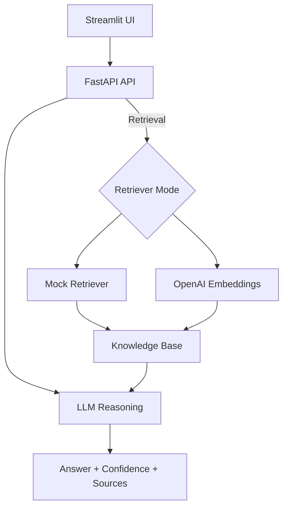

# 💬 Personal RAG Q&A System

> **Intelligent Q&A system for personal websites powered by RAG technology with advanced anti-hallucination strategies**

[](https://www.python.org/downloads/)
[](https://fastapi.tiangolo.com/)
[](https://streamlit.io/)
[](https://opensource.org/licenses/MIT)

## 🔗 Quick Links

- **Live Demo / Frontend**: `http://localhost:8501` (after running `streamlit run frontend/personal_app.py`)
- **API Docs (FastAPI)**: `http://localhost:8000/docs`
- **Quickstart**: [Getting Started](#-quick-start)
- **Architecture & Metrics**: [Architecture](#-architecture) · [Metrics & Evaluation](docs/metrics.md)
- **Contributing**: [CONTRIBUTING.md](CONTRIBUTING.md)
- **Data Quality & Monitoring**: [Observability Notes](docs/observability.md)

## 🎯 Overview

This project demonstrates a **production-ready RAG (Retrieval-Augmented Generation) system** specifically designed for personal website Q&A functionality. Visitors can ask questions about you in natural language, and the system provides accurate, context-aware answers based on your personal knowledge base.

### Key Highlights

- ✅ **Anti-Hallucination Strategies**: Multiple mechanisms ensure AI doesn't fabricate information
- ✅ **Production-Ready**: Structured logging, metrics, monitoring, and feedback collection
- ✅ **Dual Mode**: Mock mode (no API costs) and OpenAI mode (high-quality embeddings)
- ✅ **Modern UI**: Conversation-style interface with real-time feedback
- ✅ **Comprehensive Testing**: Unit tests, integration tests, and CI/CD pipeline

## 🏗️ Architecture

```
┌─────────────────┐
│  Streamlit UI   │  (Modern Conversation Interface)
└────────┬────────┘
         │
         ▼
┌─────────────────┐
│   FastAPI API   │  (REST Endpoints + Metrics)
└────────┬────────┘
         │
    ┌────┴────┐
    ▼         ▼
┌────────┐ ┌──────────┐
│ Mock   │ │  OpenAI  │  (Embedding Models)
│ Retriever│ │ Embeddings│
└───┬────┘ └────┬─────┘
    │           │
    └─────┬─────┘
          ▼
    ┌──────────┐
    │ Knowledge│  (Personal Data)
    │   Base   │
    └─────┬────┘
          │
          ▼
    ┌──────────┐
    │   LLM    │  (GPT-3.5/4)
    │ Reasoning│  (Low Temp + Strict Prompts)
    └──────────┘
          │
          ▼
    ┌──────────┐
    │ Response │  (With Confidence + Sources)
    └──────────┘
```

### Diagram (Mermaid)



## 🛡️ Anti-Hallucination Strategies

This system implements **4 key strategies** to prevent AI fabrication:

### 1. **Low Temperature Generation** (0.3)
- Reduces randomness in LLM responses
- Increases determinism and factual accuracy
- Configurable via environment variables

### 2. **Strict Prompt Engineering**
- Explicit system prompts: "Only use provided context"
- Clear instructions to state when information is unavailable
- No speculation or fabrication allowed

### 3. **Confidence Assessment**
- Three-level confidence scoring (High/Medium/Low)
- Based on retrieval similarity scores
- Visual indicators in UI

### 4. **Source Tracing & Verification**
- Every answer includes source documents
- Relevance scores for each source
- Optional second-pass verification mode

## ✨ Features

### Core Capabilities
- 🔤 **Semantic Search** - Natural language queries with OpenAI embeddings
- 🤖 **RAG-Powered Q&A** - Contextual answers with LLM integration
- 💬 **Conversation Mode** - Multi-turn dialogue with context retention
- 📊 **Real-time Metrics** - Monitor system performance and latency
- 💭 **User Feedback** - Collect ratings to improve quality

### Technical Features
- **Dual Retrieval Modes**: Mock (keyword-based, no API) or OpenAI (semantic embeddings)
- **Structured Logging**: JSON-formatted logs for production monitoring
- **Metrics Endpoint**: Prometheus-compatible metrics for observability
- **Feedback Collection**: Store user feedback for continuous improvement
- **Category Weighting**: Boost important document categories (FAQ, personal info)

## 🧭 Data Quality & Monitoring (Optional)

This project does not ingest streaming wearable data by default, but extension
points are documented for data validation and drift monitoring:

- [Observability Notes](docs/observability.md)

## 🚀 Quick Start

### Prerequisites
- Python 3.11-3.12
- OpenAI API key (optional, for OpenAI mode)

### Installation (Local)

1. **Clone the repository**
```bash
git clone https://github.com/yourusername/multimodal-rag-system.git
cd multimodal-rag-system
```

2. **Create virtual environment**
```bash
python -m venv venv
source venv/bin/activate  # On Windows: venv\Scripts\activate
```

3. **Install dependencies**
```bash
# Install lightweight dependencies (recommended)
pip install -r requirements_simple.txt
```

4. **Configure environment**
```bash
cp .env.example .env
# Edit .env and add your OPENAI_API_KEY (optional for mock mode)
```

5. **Prepare knowledge base**
```bash
# Edit data/raw/knowledge_base.json with your personal information
# See docs/PERSONAL_RAG_README.md for structure details
```

6. **Start the system**
```bash
# Option 1: Use the run script (starts both API and frontend)
python run.py

# Option 2: Start separately
# Terminal 1: API
uvicorn src.api.personal_api:app --reload --port 8000

# Terminal 2: Frontend
streamlit run frontend/personal_app.py
```

7. **Access the application**
   - Frontend: http://localhost:8501
   - API Docs: http://localhost:8000/docs
   - Health Check: http://localhost:8000/health

### Docker Quick Start

```bash
# Build and run API + frontend
docker-compose up --build

# Access
# Frontend: http://localhost:8501
# API Docs: http://localhost:8000/docs
```

## 📖 Usage

### API Endpoints

#### Ask a Question
```bash
curl -X POST "http://localhost:8000/ask" \
  -H "Content-Type: application/json" \
  -d '{
    "question": "What technologies are you proficient in?",
    "k": 5,
    "use_verification": false,
    "conversational": false
  }'
```

#### Get Metrics
```bash
curl http://localhost:8000/metrics
```

#### Submit Feedback
```bash
curl -X POST "http://localhost:8000/feedback" \
  -H "Content-Type: application/json" \
  -d '{
    "question": "What is your experience?",
    "answer": "...",
    "rating": 5,
    "helpful": true
  }'
```

### Frontend Features

- **💬 Chat Interface**: Conversation-style UI with message bubbles
- **📊 Analytics Tab**: View system metrics and performance
- **🌓 Theme Toggle**: Light/dark mode support
- **💭 Feedback**: Rate answers with emoji reactions
- **📖 Source Viewing**: Expand to see where answers come from

## 🧪 Testing

Run the test suite:

```bash
# Install test dependencies
pip install pytest pytest-cov

# Run all tests
pytest tests/ -v

# Run with coverage
pytest tests/ --cov=src --cov-report=html

# Run specific test file
pytest tests/test_api.py -v
```

## 📁 Project Structure

```
multimodal-rag-system/
├── data/
│   ├── raw/
│   │   └── knowledge_base.json    # Your personal data
│   └── processed/
│       ├── retriever.pkl          # OpenAI embeddings index
│       └── mock_retriever.pkl     # Mock keyword index
├── src/
│   ├── api/
│   │   └── personal_api.py        # FastAPI backend
│   ├── rag/
│   │   ├── knowledge_processor.py # Knowledge base builder
│   │   ├── retriever.py           # OpenAI retriever
│   │   ├── mock_retriever.py      # Mock retriever
│   │   └── pipeline.py            # RAG pipeline with anti-hallucination
│   └── utils/
│       ├── config.py              # Configuration management
│       └── logger.py              # Structured logging
├── frontend/
│   └── personal_app.py            # Streamlit UI
├── tests/
│   ├── test_api.py                # API tests
│   └── test_retriever.py          # Retriever tests
├── docs/                          # Additional documentation
│   ├── PERSONAL_RAG_README.md     # Detailed personal RAG doc
│   ├── DEPLOYMENT.md              # Deployment guide
│   ├── WORKFLOW.md                # Recommended workflow
│   ├── TROUBLESHOOTING.md         # General troubleshooting
│   └── TERMINAL_TROUBLESHOOTING.md# Terminal-specific tips
├── scripts/                       # Helper scripts
│   ├── run_simple.sh              # One-click local start
│   ├── start_api.sh               # Start API only
│   ├── restart.sh                 # Restart services
│   ├── rebuild_index.sh           # Rebuild knowledge index
│   └── quick_fix.sh               # Common terminal fixes
├── .env.example                   # Environment template
├── requirements_simple.txt        # Lightweight dependencies
├── requirements.txt               # Full dependencies (optional)
├── run.py                         # Launch script (API + UI)
└── README.md                      # This file
```

## 🔧 Configuration

### Environment Variables

```bash
# Required for OpenAI mode
OPENAI_API_KEY=sk-...

# Optional
LLM_MODEL=gpt-3.5-turbo          # or gpt-4
USE_MOCK=true                     # Use mock mode (no API costs)
API_URL=http://localhost:8000
LOG_LEVEL=INFO
```

### Knowledge Base Structure

See `docs/PERSONAL_RAG_README.md` for detailed structure. Key sections:
- `personal_info`: Basic information
- `skills`: Technical skills
- `projects`: Project experience
- `experience`: Work history
- `education`: Education background
- `faq`: Frequently asked questions

## 📊 Performance Metrics

The system tracks:
- **Request Count**: Total API requests
- **Average Latency**: Response time in milliseconds
- **Error Rate**: Percentage of failed requests
- **Question Count**: Total questions answered
- **Feedback Count**: User feedback submissions

Access via `/metrics` endpoint or frontend Analytics tab.

## 🚢 Deployment

### Docker Deployment

```bash
# Build and run
docker-compose up --build

# Access services
# Frontend: http://localhost:8501
# API: http://localhost:8000
```

### Streamlit Cloud

1. Push code to GitHub
2. Connect to Streamlit Cloud
3. Set main file: `frontend/personal_app.py`
4. Add secrets: `API_URL` (your backend URL)

See `docs/DEPLOYMENT.md` for detailed instructions.

## 💼 Resume Highlights

This project demonstrates:

### Technical Skills
- **Machine Learning**: RAG pipeline design, embedding models, semantic search
- **Backend Development**: FastAPI, REST APIs, structured logging, metrics
- **Frontend Development**: Streamlit, modern UI/UX design
- **MLOps**: Model deployment, monitoring, feedback loops
- **Software Engineering**: Testing, CI/CD, code quality

### Key Achievements
- ✅ Implemented 4 anti-hallucination strategies (prompt constraints, low temperature, confidence scoring, source tracing)
- ✅ Added metrics and logging hooks so latency, error rate and request volume can be measured per environment
- ✅ Created modern conversation UI with real-time feedback and analytics
- ✅ Set up a testable API and project structure; coverage and performance depend on the dataset and hardware you run it on
- ✅ Designed dual-mode system (mock/OpenAI) so you can iterate UI and tests without incurring API costs

## 🧠 Design Decisions (Why these choices?)

- **Why mock mode?**  
  Added a mock retriever and mock RAG pipeline so the UI and API can be exercised without any external APIs or GPU. This is the default for CI and local development.

- **Why OpenAI instead of self-hosted models?**  
  The pipeline is implemented in a way that the retriever and generator are pluggable, but OpenAI embeddings + GPT are used as a pragmatic baseline for a personal portfolio project.

- **Why "answer only from retrieved context"?**  
  The generation step is constrained to the retrieved snippets and uses explicit instructions to say "I do not have enough information" when recall is low, trading off creativity for reliability.

- **Why keep CLIP / heavier multimodal components optional?**  
  Multimodal and heavy Torch dependencies are kept out of the Streamlit-only requirements so that lightweight deployments (e.g., Streamlit Cloud) do not have to build GPU stacks.

- **Why FAISS vs. hosted vector DBs?**  
  For local and educational usage, an in-process index (FAISS) is easier to reproduce and reason about. The code is structured so that a hosted vector database (like Pinecone) can be swapped in for production if needed.

## 🤝 Contributing

Contributions welcome! Please:
1. Fork the repository
2. Create a feature branch
3. Add tests for new features
4. Submit a pull request

## 📝 License

MIT License - see [LICENSE](LICENSE) file for details.

## 🙏 Acknowledgments

- OpenAI for GPT models and embeddings
- FastAPI and Streamlit teams
- RAG research community

## 📧 Contact

For questions or feedback, please open an issue on GitHub.

---

**Built with ❤️ for demonstrating production-ready RAG systems with anti-hallucination strategies**
